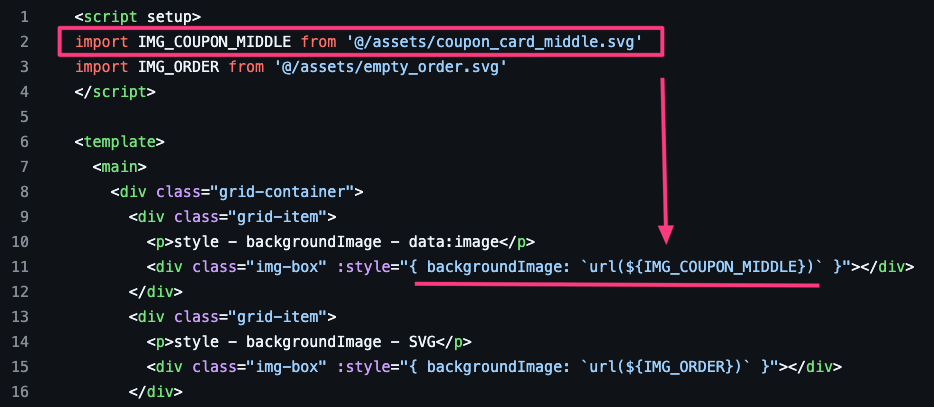

# Vue - style & backgroud-image & svg(data-image)

Demo：[Cloudflare Page](https://63e81c67.vite-background-image-svg.pages.dev/)

## 問題

當使用 **inline style** 的方式，去撰寫 **background-image** 的 **url** 時，

在遇到 url 的圖片**有無轉換**變成 **data:image** 的話，會產生二種不同的狀況

- 當圖片 Size 太小，被 vite 轉換成 **data:image** 格式的話，顯示不正常

  

  可以看下圖，連 style 都沒顯示出來

  

- 當圖片 Size 正常，沒有被轉換時，顯示就正常

  

  可以看到下圖，style 是有值的

  

- 補充：\
  如果是用 **CSS** 的方式寫 `background-image: url("xxx.svg");` 的話，\
  不管圖片有沒有被轉換成 **data:image** 格式，皆可正常顯示。

---

## 原因

1. `url()` 中沒有最外面的 quote 的話，遇到小括號、空格、單雙引號時需要跳脫 [ref](https://developer.mozilla.org/en-US/docs/Web/CSS/url_function#syntax)

    > If you choose to write the URL without quotes, use a backslash (\\) before any parentheses, whitespace characters, single quotes (‘) and double quotes (“) that are part of the URL.

2. 其次直接加 double quotes 會觸發 vue eslint rule: `Attribute name cannot contain U+0022 ("), U+0027 ('), and U+003C (<).` 所以整個往上搬後就可以順利 render 了

3. **image** 被轉換成 **data:image** 時，url 裡面的值是**沒有**被加雙引號。

   

4. 額外測試紀錄 ([JSbin](https://jsbin.com/gagalitazu/edit?html,output))\
   如果有用**雙引號**的跳脫字元 (`&quot;`) 包起來的話，就可以正常看到圖片 (藍線)，\
   如果沒加**雙引號**的話，就無法正常顯示圖片 (綠線)。

   

---

## 解決

如果先在 **script** 先計算完成，在 **template** 用 **bind-style** 的方式，即可正常顯示。

解法：<https://github.com/kanboo/vite-background-image-svg/pull/1/files>

---